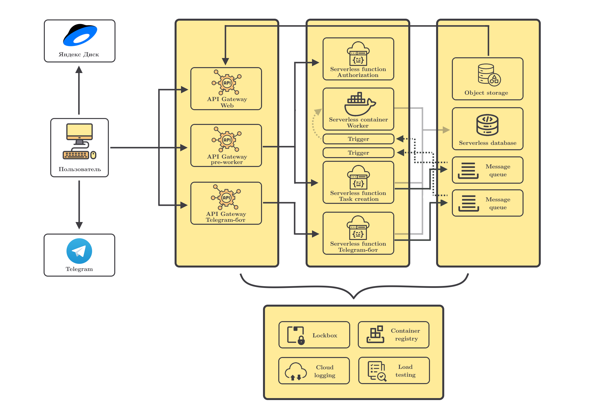

# ContestED

---

***ContestED (Contest Educational)*** предоставляет serverless подход к тестированию тренировочных задач.

    Платформы для проверки решений учебных задач по       программированию позволяют проводить различные тестирования программного кода. Такие платформы преимущественно направлены на проверку корректности выполнения задач в рамках изучения спортивного программирования и бэкенд-разработки.

    Данная работа представляет возможности применение облачных технологий для тестирование программного кода. Кроме того, в работе проводится сравнительный анализ использования такого подхода в сравнении с классическим тестированием на выделенных серверах. Результатом выполнения работы является платформа, построенная с концепцией CaaS (Cloud as a Service), поддерживающая автоматизированное тестирование для языков C++ и Python. 

---

### Навигация

- Папка `Cloud` содержит исходный код сервисов для установки в Яндекс.Облако.

- Папка `Paper` содержит текст дипломной работы, а также презентацию.

- Папка `Tasks` содержит условия, решения и описания к тренировочным задачам, созданным для тестирования.

- Папка `Testing` содержит набор скриптов и настроек агентов для тестирования системы.

- Папка `Setup` содержит инструкции к настройке 

- Дальнейшие сценарии улучшения системы отражены в файле `TODO.md`.

---

### Архитектура решения

---

### Полезные ссылки

Эти ссылки могут быть полезны преподавателям для создания своих контестов.

1. [АИСД-1 | 2 модуль | Python](http://wiki.cs.hse.ru/%D0%90%D0%BB%D0%B3%D0%BE%D1%80%D0%B8%D1%82%D0%BC%D1%8B_%D0%B8_%D1%81%D1%82%D1%80%D1%83%D0%BA%D1%82%D1%83%D1%80%D1%8B_%D0%B4%D0%B0%D0%BD%D0%BD%D1%8B%D1%85_1_2020/2021)

2. [АИСД-1 | 4 модуль | C++](http://wiki.cs.hse.ru/%D0%90%D0%BB%D0%B3%D0%BE%D1%80%D0%B8%D1%82%D0%BC%D1%8B_%D0%B8_%D1%81%D1%82%D1%80%D1%83%D0%BA%D1%82%D1%83%D1%80%D1%8B_%D0%B4%D0%B0%D0%BD%D0%BD%D1%8B%D1%85_1_2020/2021_(4_%D0%BC%D0%BE%D0%B4%D1%83%D0%BB%D1%8C))

---
